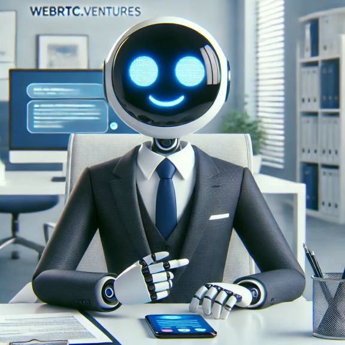

# Simple Chatbot

This repository demonstrates a simple AI chatbot with real-time audio/video interaction, implemented using different client and server options. The bot server supports multiple AI backends, and you can connect to it using multiple client approaches. In this demo we use Daily WebRTC SDK.



## Bot

1. **Ollama Bot** (Default)

   - Uses open source Llama3 for conversation
   - Requires Ollama running locally: https://ollama.com/download with llama3.2:1b. 
   Other Llama supported models can be configured here (e.g: Llama 7b or DeepSeek 1.5b)

2. **OpenAI Bot**

   - Uses gpt-4o-mini for conversation
   - Requires OpenAI API key

## Client

1. **JavaScript**

   - Basic implementation using [Pipecat JavaScript SDK](https://docs.pipecat.ai/client/js/introduction)
   - No framework dependencies

## Quick Start

### First, start the bot server:

1. Navigate to the server directory:
   ```bash
   cd server
   ```
2. Create and activate a virtual environment:
   ```bash
   python3 -m venv venv
   source venv/bin/activate  # On Windows: venv\Scripts\activate
   ```
   #you can also use Conda as an alternative
3. Install requirements:
   ```bash
   pip install -r requirements.txt
   ```
4. Copy env.example to .env and configure:
   - Choose your bot implementation:
     ```ini
     BOT_IMPLEMENTATION=      # Options: 'ollama' (default) or 'openai'
     ```
   - Add your API keys (if required)
5. Start the server:
   ```bash
   python server.py
   ```

### Next, connect using your preferred client app:

- [JavaScript Guide](https://github.com/pipecat-ai/pipecat/blob/main/examples/simple-chatbot/client/javascript/README.md)

## Important Note

The bot server must be running for any of the client implementations to work. Start the server first before trying any of the client apps.

## Requirements

- Python 3.10+
- Node.js 16+
- Daily API key for streaming audio
- OpenAI API key or Ollama running locally for inference
- ElevenLabs API key for Text to Speech
- Modern web browser with WebRTC support

## Project Structure

```
simple-chatbot/
├── server/              # Bot server implementation
│   ├── bot-openai.py    # OpenAI bot implementation
│   ├── bot-ollama.py    # Ollama bot implementation
│   ├── runner.py        # Server runner utilities
│   ├── server.py        # FastAPI server
│   └── requirements.txt
└── client/              # Client implementations
    └── javascript/      # Daily JavaScript connection
```